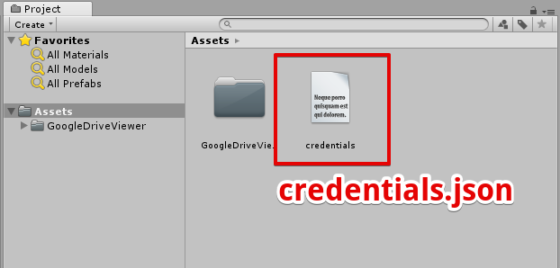
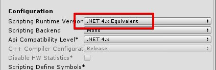
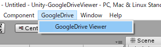
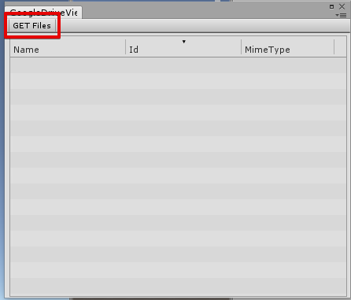

# Unity-GoogleDriveViewer
Unity-GoogleDriveViewer is a tool to list GoogleDrive files.

## Unity version
Unity 2018.3.x

## creadentials.json
You need to create credentials.json.

https://developers.google.com/drive/api/v3/quickstart/dotnet

## Unity Settings
Change scripting runtime version to **".NET 4.x Equivalennt"**

# How to use

Select **"GoogleDrive/GoogleDrive Viewer"**.

 
Click "Get FILES" button.

